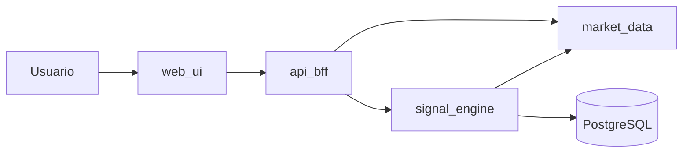

# Plan del proyecto: señales de inversión con microservicios (3 semanas, 2 personas)

---

## A. Resumen ejecutivo del proyecto

Construiremos un **MVP** que ingiere **series de precios simuladas o públicas** (sin ejecución de órdenes ni dinero real), aplica **reglas simples** (por ejemplo cruce de medias móviles y umbral de variación porcentual) y expone **señales BUY / SELL / HOLD** con trazabilidad básica. El sistema se desplegará en **contenedores** sobre **Kubernetes administrado**, empaquetado con **Helm**, con **CI/CD en GitHub Actions**, **métricas en Prometheus** y **dashboards en Grafana**. El foco es **demostrar arquitectura de microservicios, ciclo de vida DevOps y observabilidad**, no sofisticación financiera.

---

## B. Alcance del MVP (exacto y terminable en 3 semanas)

**Incluido (imprescindible):**

- **3 microservicios backend** más **1 frontend** (el frontend cuenta como componente desacoplado; los microservicios son lógica de dominio y datos).
- **Fuente de datos:** API pública gratuita con límites razonables **o** generador interno de precios sintéticos (serie temporal) como respaldo si la API falla o rate-limit.
- **Motor de señales:** 2 reglas concretas, por ejemplo: (1) cruce de **SMA(5)** vs **SMA(20)**; (2) **cambio %** en ventana corta (ej. 24 “velas” o 24 puntos) respecto a umbral configurable por variables de entorno.
- **Persistencia mínima:** historial de señales generadas (símbolo, timestamp, regla disparada, valor indicadores, resultado BUY/SELL/HOLD) y opcionalmente últimos precios cacheados.
- **Exposición:** REST detrás de **Ingress**; documentación OpenAPI en al menos un servicio.
- **Kubernetes + Helm:** un chart por servicio o un **umbrella chart** (decisión única: **umbrella chart** `charts/signals-platform` con subcharts).
- **CI/CD:** build de imágenes, push a registry, `helm upgrade` o entrega de artefactos versionados (tag semver).
- **Observabilidad:** Prometheus scrape de `/metrics` (formato Prometheus) en servicios; Grafana con 1–2 dashboards.

**Fuera de alcance (explícitamente no):**

- Broker, wallets, KYC, ejecución de órdenes, backtesting serio, machine learning, alta frecuencia, multi-tenant, seguridad bancaria nivel producción.

**Criterio de “terminado”:** demo en vídeo o capturas: usuario consulta símbolo → ve precio reciente → ve última señal y motivo → Grafana muestra métricas vivas → `kubectl get pods` saludable.

---

## C. Arquitectura propuesta

**Microservicios y responsabilidades (decisión única):**

| Servicio | Responsabilidad |
|----------|-----------------|
| **market-data** | Obtiene o genera OHLC/close simulado; normaliza a un modelo común; expone REST interno (`GET /prices/{symbol}`) y opcionalmente publica eventos (si no hay tiempo, solo REST síncrono). |
| **signal-engine** | Lee precios desde **market-data** (HTTP); calcula indicadores; persiste señal; expone `GET /signals/latest?symbol=` y `GET /signals/history`. |
| **api-gateway (BFF)** | Un único punto para el frontend: agrega llamadas a market-data y signal-engine; CORS; timeouts; no lógica de trading. Implementación recomendada: **Spring Cloud Gateway** o **FastAPI** como BFF ligero (elegimos **FastAPI** en el stack D para homogeneidad Python). |
| **web-ui** | SPA simple: selector de símbolo, tabla de últimas señales, indicador visual BUY/SELL/HOLD. |

**Flujo de datos (síncrono, simple):**



1. UI llama al BFF: “estado del símbolo”.
2. BFF llama a **market-data** por serie reciente.
3. BFF solicita a **signal-engine** “recalcular o leer última señal” (signal-engine a su vez llama a market-data si necesita frescura).
4. **signal-engine** escribe en **PostgreSQL** cada señal generada.

**Base de datos recomendada:** **PostgreSQL** (un solo cluster gestionado pequeño o desplegado en K8s con chart Bitnami solo si aceptan operación; para MVP académico con mínima fricción: **Azure Database for PostgreSQL Flexible Server** en tier mínimo **o** Postgres en K8s vía Helm con PVC; **decisión:** Postgres en K8s con subchart Bitnami para no multiplicar cuentas de facturación, con backup deshabilitado y datos descartables).

**API Gateway / comunicación:** **Ingress NGINX** como entrada TLS opcional (HTTP basta en MVP); **BFF** como “gateway de aplicación”; comunicación **REST síncrono** entre servicios (sin Kafka en MVP).

---

## D. Stack tecnológico recomendado (elecciones concretas)

| Capa | Elección | Por qué |
|------|----------|---------|
| Backend | **Python 3.12 + FastAPI + Uvicorn** | Velocidad de desarrollo, tipado con Pydantic, fácil exponer `/metrics` con `prometheus_client`, buen encaje con cálculos de series. |
| Frontend | **React + Vite + TypeScript** | Estándar de industria, build estático servido por nginx en contenedor. |
| Base de datos | **PostgreSQL 16** | Relacional simple para historial de señales y consultas de entrega. |
| Contenedores | **Docker** multi-stage (build + runtime distroless/slim) | Requisito de actividad; imágenes pequeñas y reproducibles. |
| Kubernetes | **AKS** (ver E) | Costo/curva de aprendizaje para estudiantes. |
| Helm | **Helm 3** + chart umbrella | Empaquetado, versionado (`Chart.yaml` appVersion), upgrades. |
| Registry | **GitHub Container Registry (ghcr.io)** | Integración natural con GitHub privado y Actions, gratuito con límites razonables para académico. |
| CI/CD | **GitHub Actions** | Requisito; matrix opcional por servicio. |
| Métricas | **Prometheus Operator** vía **kube-prometheus-stack** (Helm) **o** Prometheus chart simple; **decisión:** **kube-prometheus-stack** si el cluster lo tolera en free tier; si no, **prometheus-community/prometheus** chart mínimo + ServiceMonitors. |
| Visualización | **Grafana** incluido en kube-prometheus-stack | Dashboards y datasource ya cableados. |
| IaC (opcional MVP) | **Bicep** o scripts `az` documentados en README | Solo si alcanza tiempo; no bloqueante. |

---

## E. Servicio de Kubernetes seleccionado y justificación

**Selección: Azure Kubernetes Service (AKS)**

- **Costo:** el plano de control de AKS **no tiene cargo por el control plane** en el modelo estándar; pagáis principalmente por **nodos** (VMs). Podéis usar **1–2 nodos pequeños** (por ejemplo `Standard_B2s`) y **apagar/escalar a 0** nodos fuera de demos si la política del curso lo permite, o borrar el cluster entre entregas y recrearlo con scripts.
- **Facilidad:** integración clara con **Azure Container Registry** (alternativa a ghcr) y flujo conocido en entornos académicos; documentación estable para **Ingress**, **LoadBalancer**, **Managed Identity** (opcional en MVP).
- **Curva de aprendizaje:** menor fricción que EKS en permisos/IAM para un primer proyecto; comparable a GKE; OpenShift suele ser más pesado operativamente y más caro para un MVP de dos personas.

**Descartes breves:** **EKS** suele sumar coste fijo del control plane; **GKE** es excelente si ya tenéis créditos GCP y preferís su consola; **OpenShift** aporta mucho PaaS pero es **overkill** para este MVP y suele ser más costoso/complejo para una actividad de 3 semanas.

---

## F. Plan de trabajo de 3 semanas (semana / tareas / R1 / R2 / entregables)

**Semana 1 — Fundamentos y vertical delgada**

| Tarea | R1 | R2 | Entregable |
|-------|----|----|------------|
| Repo GitHub **privado**, ramas `main`/`develop`, plantillas de PR, `.gitignore` | X | apoyo | Repo inicial |
| Contrato OpenAPI v0.1 (modelo `PricePoint`, `Signal`) | X | revisión | `docs/api-contract.md` o openapi yaml |
| **market-data** MVP (mock + 1 fuente pública opcional) + Dockerfile | X | pruebas | Imagen + README de uso |
| **PostgreSQL** esquema `signals` + migración (Alembic o SQL simple) | apoyo | X | Script/migración versionada |
| **signal-engine** reglas SMA + % change + tests unitarios | X | X | Tests + endpoint `/signals` |
| **BFF** agrega endpoints + healthchecks | apoyo | X | BFF funcional local con docker-compose |
| docker-compose local (4 servicios + db) | X | X | `docker-compose.yml` |
| Documentar decisión K8s (AKS) 1 página | X | X | `docs/adr/001-kubernetes.md` |

**Semana 2 — Kubernetes, Helm, CI/CD, observabilidad base**

| Tarea | R1 | R2 | Entregable |
|-------|----|----|------------|
| Manifiestos base + **Helm umbrella** con values por entorno (`dev`) | X | revisión | `charts/signals-platform` |
| AKS: crear cluster, **Ingress NGINX**, namespaces | X | X | Capturas + notas en `docs/runbook.md` |
| GH Actions: **lint/test/build** por servicio; push a **ghcr** | X | apoyo | `.github/workflows/ci.yml` |
| GH Actions: job de **release** (tag) que publica chart/imágenes | apoyo | X | `.github/workflows/release.yml` |
| Prometheus scrape labels (`app.kubernetes.io/name`) | X | X | `ServiceMonitor` o anotaciones scrape |
| Grafana: dashboard “salud + RPS + latencias” | apoyo | X | `grafana/dashboards/*.json` en repo |
| **web-ui** pantallas mínimas consumiendo BFF | X | X | UI desplegable |

**Semana 3 — Endurecimiento, evidencias, demo**

| Tarea | R1 | R2 | Entregable |
|-------|----|----|------------|
| Hardening MVP: límites de recursos, probes, HPA opcional documentado | X | X | values.yaml ajustados |
| SLIs mínimos: tasa de errores 5xx, latencia p95 | apoyo | X | paneles Grafana |
| Documentación DevOps: diagramas, pipeline, “cómo desplegar” | X | X | `docs/` completo |
| Video demo 5–8 min + capturas para rúbrica | X | X | enlace/carpeta `docs/evidence/` |
| Ensayo de destrucción: borrar pod, ver recuperación | apoyo | X | nota en runbook |

---

## G. Estructura del repositorio en GitHub

```text
integradora/
  README.md
  LICENSE
  .editorconfig
  .gitignore
  docker-compose.yml
  docs/
    architecture.md
    runbook.md
    evidence/
    adr/
      001-kubernetes-ak.md
  services/
    market-data/
      app/
      Dockerfile
      pyproject.toml / requirements.txt
      tests/
    signal-engine/
      app/
      Dockerfile
      tests/
    api-bff/
      app/
      Dockerfile
      tests/
  web-ui/
    src/
    Dockerfile
    nginx.conf
  charts/
    signals-platform/
      Chart.yaml
      values.yaml
      charts/
        market-data/
        signal-engine/
        api-bff/
        web-ui/
        postgresql/   # subchart o dependencia en Chart.yaml
  deploy/
    ingress/
    namespaces.yaml
  monitoring/
    prometheus-rules/   # opcional
    grafana/dashboards/
  .github/
    workflows/
      ci.yml
      release.yml
    pull_request_template.md
```

---

## H. Pipeline CI/CD (simple y realista)

**Workflow `ci.yml` (en cada push/PR a `main`/`develop`):**

1. **Checkout**
2. **Matrix** por carpeta `services/*` y `web-ui` (jobs paralelos)
3. Pasos: instalar runtime (Python/Node), **cache** de dependencias
4. **Lint** (ruff/eslint), **tests** (pytest/vitest), **build Docker** (`docker build`) con tag `ghcr.io/<org>/<svc>:sha-<short_sha>`
5. (Opcional PR) escaneo ligero **Trivy** en modo no bloqueante o umbral bajo

**Workflow `release.yml` (al crear tag `v*.*.*`):**

1. Build y push imágenes con tag semver y `latest`
2. `helm package` del umbrella chart + subcharts
3. Publicación como **GitHub Release** con artefacto `.tgz` **o** push a OCI Helm (solo si tenéis tiempo; si no, artefacto en Release es suficiente evidencia)
4. Job manual `workflow_dispatch` **deploy** que ejecuta `helm upgrade --install` contra AKS usando secret `KUBE_CONFIG` (base64) o mejor **OIDC federado con Azure** si alcanzáis; para 3 semanas es aceptable **kubeconfig en secret** con rotación documentada como deuda.

---

## I. Plan de monitoreo con Prometheus y Grafana

**Métricas (Prometheus) mínimas:**

- **Infra:** `kube_pod_status_phase`, `container_cpu_usage_seconds_total`, `container_memory_working_set_bytes` (si usáis stack con cAdvisor/kubelet metrics).
- **App (custom por servicio):** `http_requests_total{route,method,status}`, `http_request_duration_seconds_bucket` (histograma), `signal_generation_total{result,reason}`, `market_data_fetch_total{source,status}`, `app_info{version}`.

**Grafana:**

- **Fila 1:** disponibilidad (pods ready), reinicios, CPU/mem por deployment.
- **Fila 2:** RPS y p95 de latencia del BFF y signal-engine.
- **Fila 3:** contador de señales por resultado (BUY/SELL/HOLD) y fallos al llamar market-data.

**Implementación:** instrumentación con **`prometheus_client`** en FastAPI + middleware de métricas; dashboards versionados en `monitoring/grafana/dashboards/` y **provisioning** por ConfigMap en Helm (sidecar o import en chart de Grafana).

---

## J. Backlog priorizado

**Imprescindibles:** market-data + signal-engine + BFF + UI mínima; Postgres con historial; Docker; AKS desplegado; Helm install/upgrade; Ingress; GitHub Actions CI con tests; Prometheus scrape; Grafana 1 dashboard; README + diagrama + evidencias.

**Deseables:** HPA documentado; Trivy en CI; OpenAPI publicado en Swagger UI del BFF; health + readiness estrictos; tags semver automáticos.

**Opcionales:** OIDC Azure↔GitHub Actions; Service Mesh (no recomendado); Kafka; multi-símbolo en tiempo casi real; alertas Alertmanager a email.

---

## K. Riesgos y mitigaciones

| Riesgo | Mitigación |
|--------|------------|
| Coste Azure fuera de control | 1–2 nodos pequeños, autoscaling desactivado, borrar/recurso fuera de demo; presupuesto y alertas en portal. |
| Rate limits API pública | Modo **mock** por defecto; caché en market-data; throttling en BFF. |
| Complejidad Helm/K8s | Umbrella chart desde semana 2 día 1; valores mínimos; no CRDs custom. |
| CI/CD secreto kubeconfig filtrado | Secretos GitHub, permisos mínimos, kubeconfig dedicado de demo, rotación mencionada en docs. |
| Sobrecarga de 2 personas | Congelar alcance en B; “done” definido por demo y checklist. |

---

## L. Evidencias para la entrega (rúbrica / portfolio)

- Diagrama C4 (nivel contenedor) exportado (PNG/PDF) en `docs/evidence/`.
- Capturas: **Azure Portal** recurso AKS, **Helm list**, `kubectl get all -n <ns>`, **Ingress** con URL accediendo a la UI.
- Capturas Grafana + Prometheus (Targets “UP”).
- **GitHub Actions** pantalla de pipeline verde + logs resaltando build/test.
- Fragmento de **Helm values** y diff de upgrade (o `helm history`).
- OpenAPI o Swagger UI accesible.
- **ADR** de elección AKS (1 página).
- Vídeo corto recorriendo flujo UI → señal → métricas.

---

## M. Plan de arranque de las primeras 24 horas (paso a paso)

1. **Hora 0–1:** Crear GitHub **privado**; invitar al compañero; proteger `main` (PR obligatorio); clonar en ambas máquinas.
2. **Hora 1–2:** Escribir **README** con visión, alcance MVP (sección B), diagrama ASCII provisional, comandos `docker-compose` futuros.
3. **Hora 2–4:** **R1** esqueleto `market-data` (FastAPI + `/health` + `/metrics` stub + endpoint mock `/prices/{symbol}`); **R2** esqueleto `signal-engine` con función pura `compute_signal(prices)`.
4. **Hora 4–6:** Acordar **contrato JSON** entre servicios; commit en `docs/api-contract.md`.
5. **Hora 6–8:** `docker-compose` con Postgres + market-data + signal-engine; semilla de datos.
6. **Hora 8–10:** Cuentas Azure; **presupuesto**; **R1** inicia `az aks create` **solo si** ya tenéis cuotas; si no, dejar documentado y seguir en compose.
7. **Hora 10–12:** **R2** Dockerfile multi-stage de ambos servicios; build local.
8. **Hora 12–16:** Primer **Helm chart** mínimo que despliega **solo market-data** en AKS (o kind/minikube local si Azure espera); verificar pods `Running`.
9. **Hora 16–20:** **GitHub Actions** `ci.yml` que al menos lint+test en PR (sin deploy aún).
10. **Hora 20–24:** Captura inicial de evidencia (compose funcionando + pipeline verde + nota de riesgos K); planificar día 2 (BFF + UI).

---

### Nota sobre el workspace actual

El directorio del curso está casi vacío salvo un [`README.md`](README.md) inicial; el plan anterior asume **arranque desde cero** siguiendo la estructura de la sección G.
