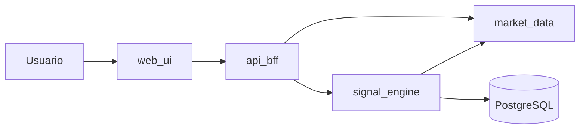

# Arquitectura (MVP)

## Vista contenedores

## Microservicios

| Componente     | Rol |
|----------------|-----|
| **web-ui**     | SPA React: consulta resumen y recalcula señal vía BFF. |
| **api-bff**    | Agrega `market-data` + `signal-engine`; CORS; sin lógica de trading. |
| **market-data**| Serie de precios **mock** determinista por símbolo. |
| **signal-engine** | Reglas SMA + cambio %; persiste historial en PostgreSQL. |
| **PostgreSQL** | Tabla `signals.signal_history`. |

## Comunicación

- **Síncrona REST** entre servicios.
- **Ingress NGINX** (AKS) hacia `web-ui`; el `nginx` del contenedor UI reenvía `/api/*` al BFF dentro del cluster.

## Datos

- No hay fuentes de pago ni ejecución de órdenes.
- Los precios son **simulados** con fines académicos.
